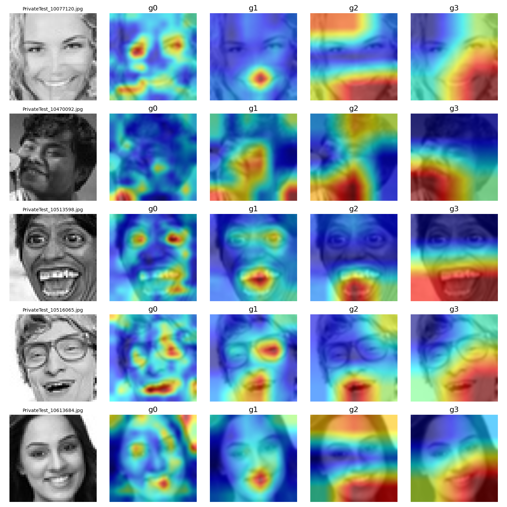
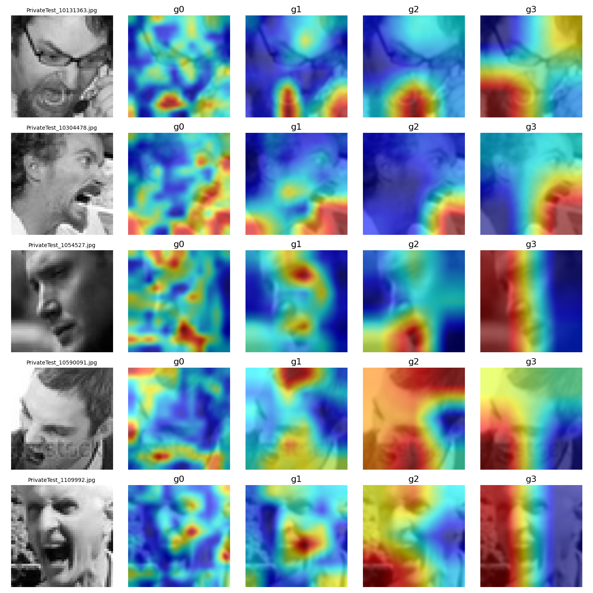
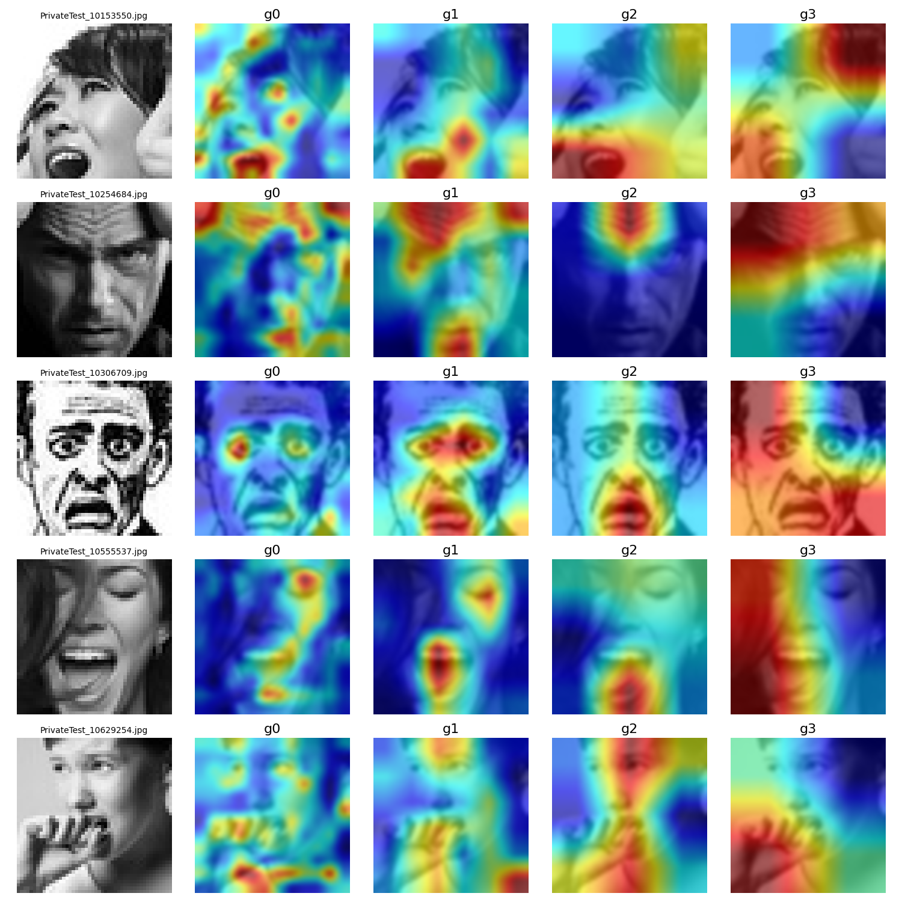

# Expression-Deciphered
Course Final Project.

<div style="display: flex;">
    
    
    
</div>

## Training Steps


To train the ResNet34 model for facial expression recognition, follow these steps:

1. **Set Basic Parameters:**
   - Image size (`img_size`): 48
   - Number of epochs (`epochs`): 15
   - Batch size (`batch_size`): 64
   - Learning rate (`learning_rate`): 0.0001

2. **Prepare the Data:**
   - Apply data augmentation and loading transformations using `transforms.Compose`.
   - Create training and testing datasets using `datasets.ImageFolder`.
   - Initialize data loaders for both training and testing datasets.

3. **Load and Modify the Pretrained ResNet Model:**
   - Load the pretrained ResNet34 model.
   - Replace the final fully connected layer to output 7 classes.

4. **Set Device for Training:**
   - Check if CUDA is available and set the device accordingly.

5. **Define Loss Function and Optimizer:**
   - Use Cross-Entropy Loss (`nn.CrossEntropyLoss`).
   - Use the Adam optimizer (`optim.Adam`).

6. **Train the Model:**
   - Perform training over the specified number of epochs.
   - In each epoch, iterate over the training data, calculate loss, and update the model's weights.

7. **Evaluate the Model:**
   - After each training epoch, evaluate the model on the test dataset.
   - Record and print the training and test loss and accuracy for each epoch.

8. **Visualize the Results:**
   - Plot the training and test accuracy as well as the loss for each epoch using `matplotlib`.

9. **Generate and Visualize the Confusion Matrix:**
   - After training, generate a confusion matrix and classification report.
   - Visualize the confusion matrix using `seaborn.heatmap`.

Remember to ensure that the training and test data directories are correctly specified in the `datasets.ImageFolder` method.


## Explain the Model

1. **Train Your Own Model or Use the Provided [Model](https://drive.google.com/file/d/1Wqx9NfS51fGHNFW1JDjFCZ5ZOjGZ1Rev/view?usp=sharing)**
2. **Generte Heat Maps**
    - Place the trained model in the `models` folder.
    - Both `attentionMap_FER.py` and `gradcam_FER.py` can be executed directly; please modify the corresponding paths.

    Example command:
    ```bash
    python attentionMap_FER.py
    python gradcam_FER.py
    ```
## Acknowledgements

We would like to express our gratitude to these repos [Grad-CAM](https://github.com/1Konny/gradcam_plus_plus-pytorch)
and [Attention-transfer](https://github.com/szagoruyko/attention-transfer). We base our project on their codes.

## References:
[1] Grad-CAM: Visual Explanations from Deep Networks via Gradient-based Localization, Selvaraju et al, ICCV, 2017 <br>
[2] Grad-CAM++: Generalized Gradient-based Visual Explanations for Deep Convolutional Networks, Chattopadhyay et al, WACV, 2018 <br>
[3] Paying More Attention to Attention: Improving the Performance of Convolutional Neural Networks via Attention Transfer, Sergey Zagoruyko and Nikos Komodakis, ICLR, 2017
